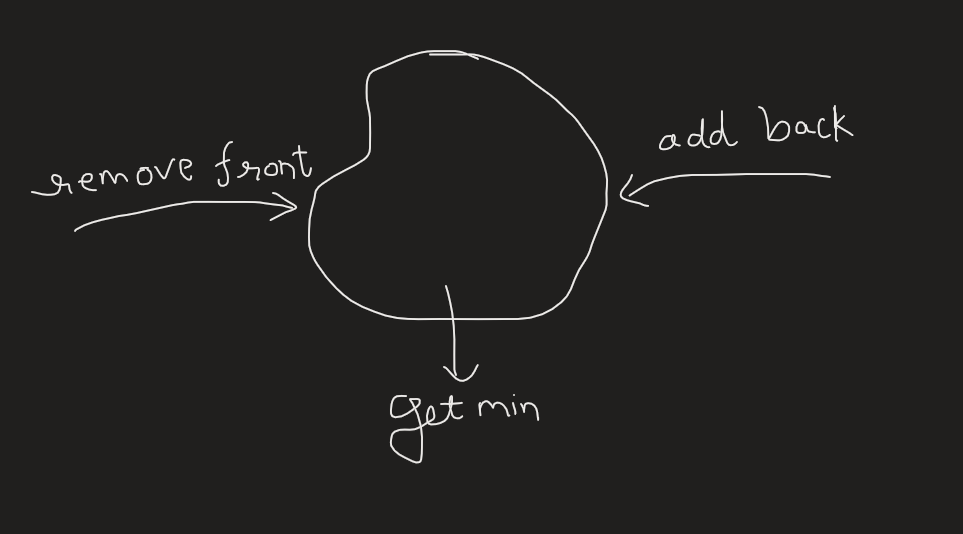

## Question:

- For a given array of size 'n' and value 'K', we need to print the minimums in each of the K sized subarrays/windows.
- Ex: [1,4,2,5,2,1,3,6], K = 3
- The windows are: [1,4,2], [4,2,5], [2,5,2], [5,2,1], [2,1,3], [1,3,6]

## Ideas:

1. We need some kind of data structure to have the capabilities: remove from front, add at back, get min of all elements inserted
   

- Idea 1: we have multiset which can be used for removing from front at O(logn), add the back number at O(logn) and get the minimum value at O(1) -> Important idea is that we should use multiset.erase(multiset.find()) to remove only the value present at a specific iterator, if we directly use the value then we would have all the values removed from the multiset matching that value.

- Idea 2: we can mould dequeue into such a structure that we have O(1) complexity for minimum value operation -> this method is called monotonic dequeue
  - We basically want to reduce the search space every time we add some numbers so that we smartly add the numbers and getting the minimum element does not need to be traversed over more values, we always want to reduce the values which could be candidate for minimum in any window.
  - consider the array [1,4,2,5,2,1,3,6] and now we start creating a dequeue of length K, [1,4,2] as soon as we were putting 2, we can see that 4 does not need to be in the dequeue for minimum value consideration, since any window of K length containing 4 after adding 2 cannot have 4 as the minimum value, so we can remove it from the dequeue as soon as we know it is useless, we have to continue this process till we remove all the useless numbers while adding any number.

  Therefore: [1,4,2] -> [1,2] -> [1,2,5] -> [1,2,5,2] -> [2] -> [1] -> [1,3] -> [1,3,6]
